# Phase 3 — Architecture Diagrams (Mermaid)

Render with any Mermaid viewer (GitHub renders ` ```mermaid ` natively).

## A. Application architecture

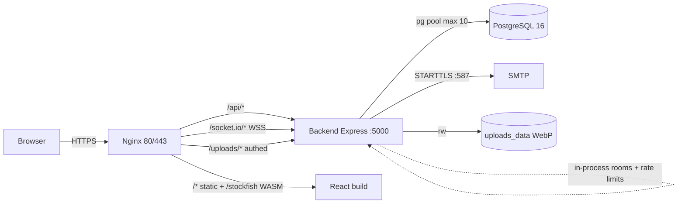

## B. Local development architecture

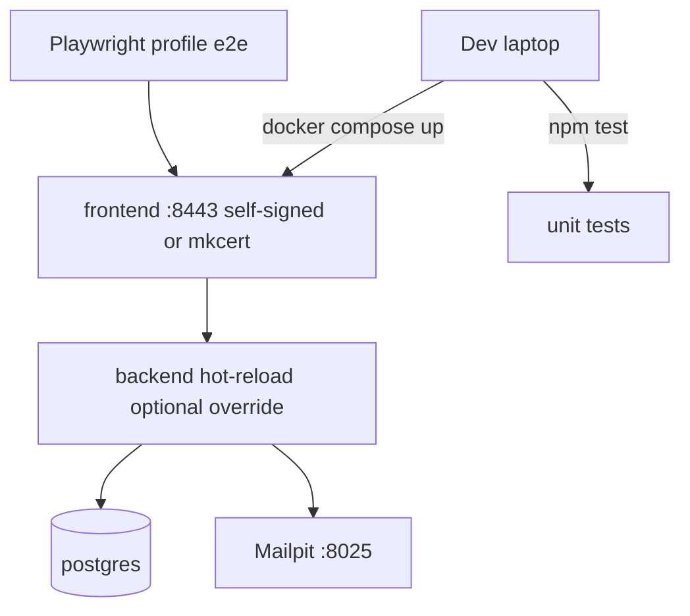

## C. Docker architecture

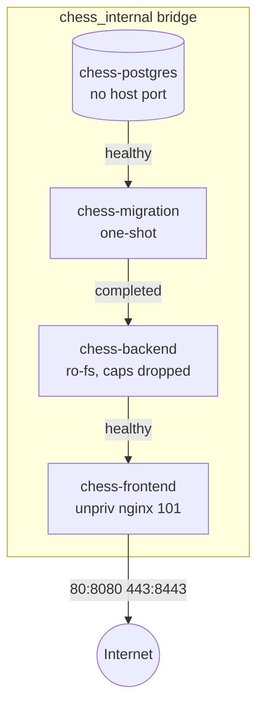

## D. Kubernetes architecture (target)

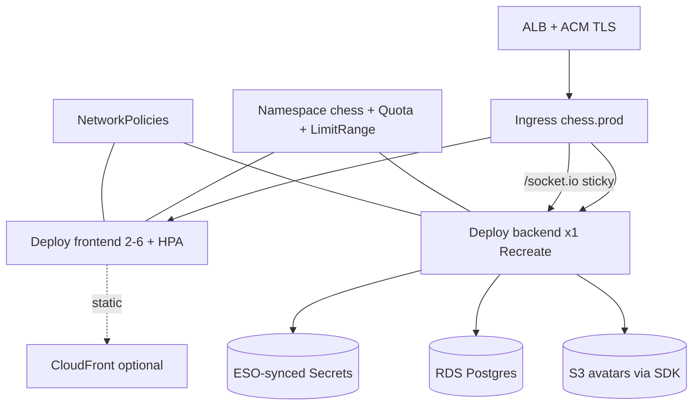

## E. AWS architecture (target)

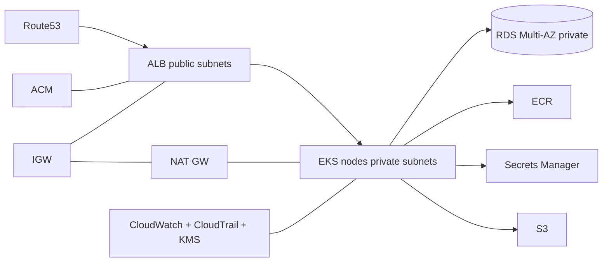

## F. EKS architecture (target)

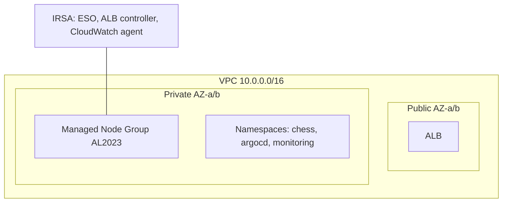

## G. CI/CD architecture (target)

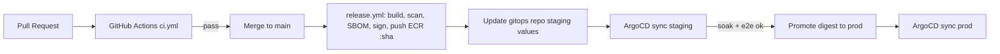

## H. DevSecOps pipeline (gates)

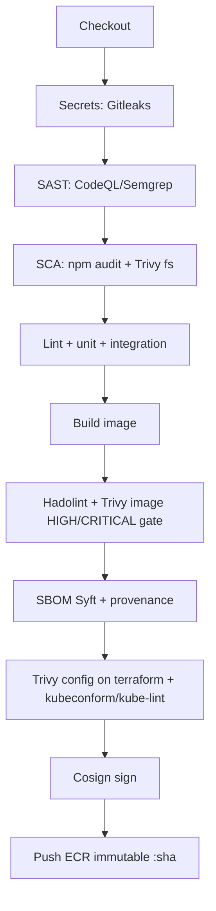

## I. GitOps architecture

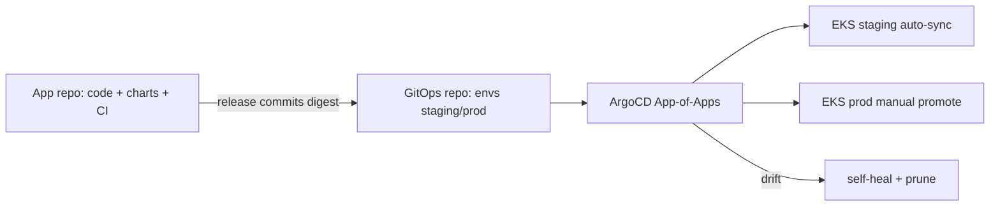

## J. Observability architecture

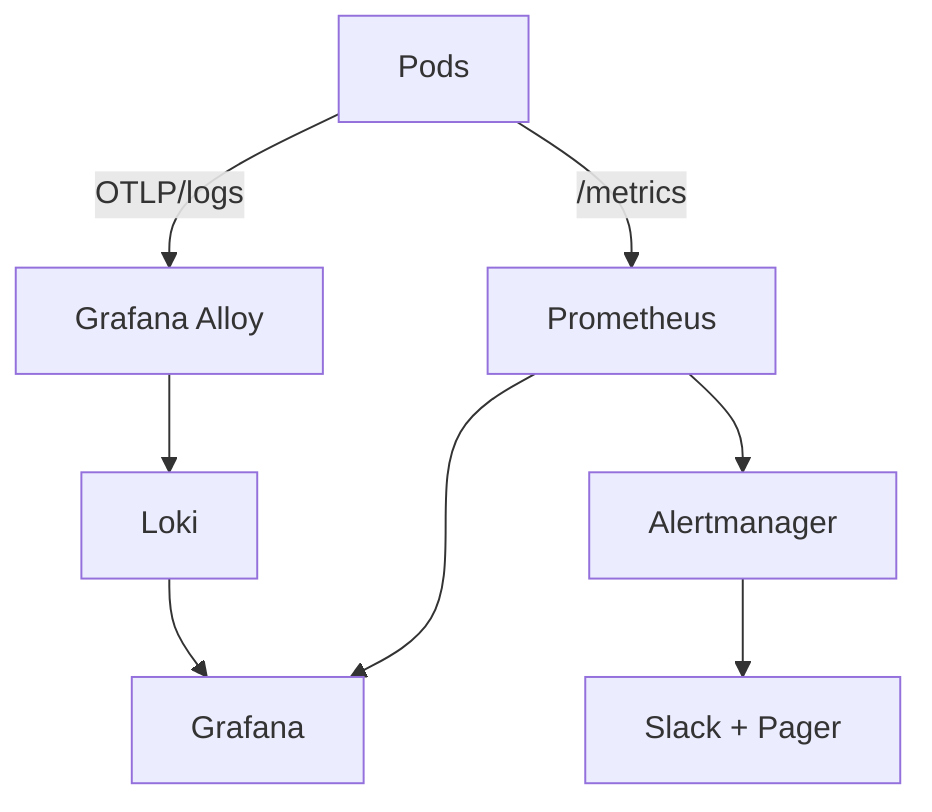

## K. Security architecture

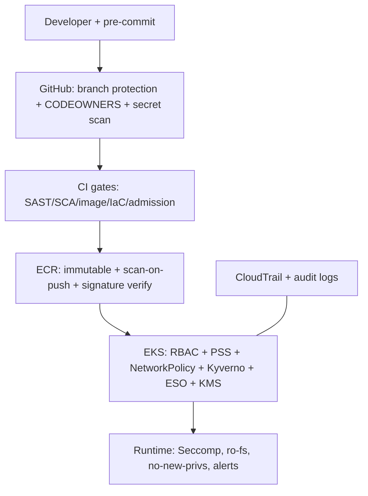

## L. Complete end-to-end production architecture

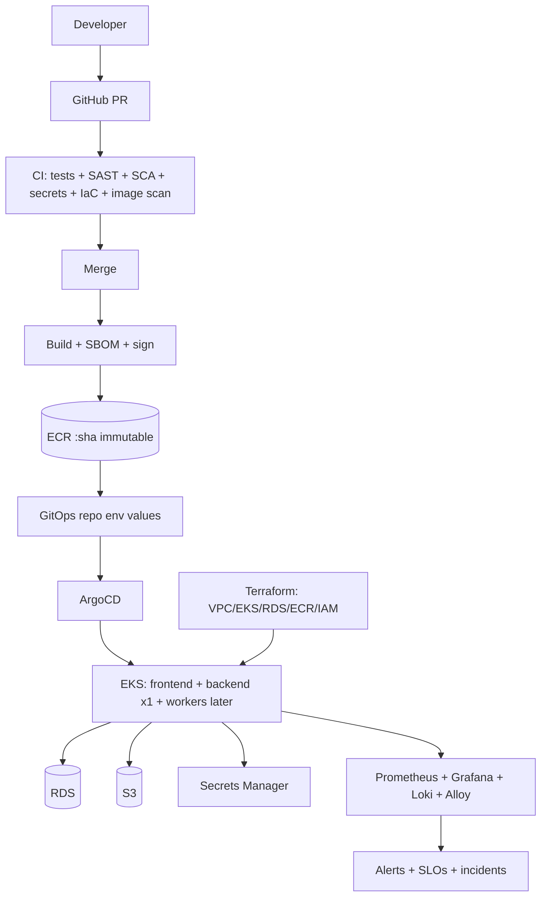
